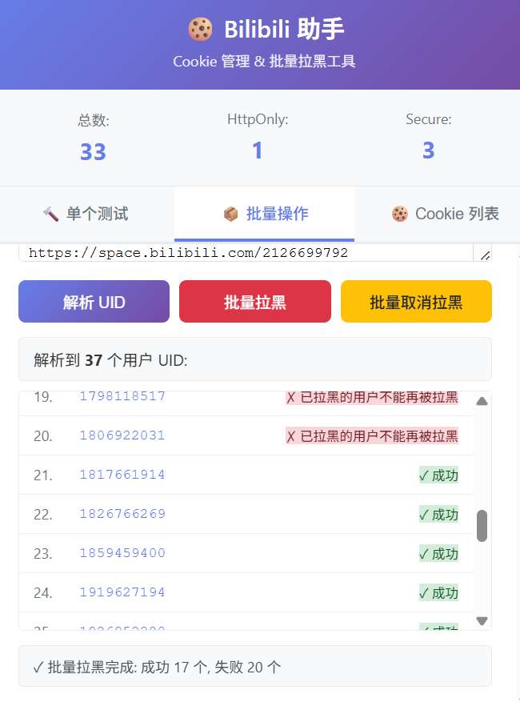

# Bilibili 快速拉黑助手 - Chrome 浏览器扩展

🚫 **批量拉黑工具**

一款用于批量用户拉黑 Bilibili 助手扩展，为了批量拉黑神人号、擦边号、广告号、站内盗视频号等等



## ✨ 功能特性

批量用户拉黑，没了

## 📦 安装方法

1. 下载源码/克隆源码
2. 打开 Chrome 浏览器,访问 `chrome://extensions/`
3. 右上角开启 **开发者模式**
4. 点击 **加载已解压的扩展程序**
5. 选择本项目文件夹
6. 扩展安装完成,工具栏会出现 🍪 图标

## 🚀 使用方法

### 🔨 【初次推荐】单个用户拉黑测试

不清楚叔叔阿姨什么时候调整 API，所以**强烈建议初次使用时测试单个用户拉黑**，防止异常情况出现

1. 切换到 "单个测试" 选项卡
2. 输入用户 UID
3. 点击 "拉黑" 或 "取消拉黑" 按钮
4. 操作成功后,会显示 "🔍 查看用户空间验证结果" 按钮
5. 点击验证按钮跳转到用户空间检查是否正常拉黑

### 📦 批量拉黑操作

1. 切换到 "批量操作" 选项卡
2. 在文本框中粘贴空间链接列表,每行一个（支持正则，支持剔除部分）:
   ```
   https://space.bilibili.com/1042653845
   https://space.bilibili.com/123456789（主要）
   https://space.bilibili.com/987654321
   ```
3. 点击 "解析 UID" 按钮,自动提取所有用户 ID
4. 查看解析结果列表
5. 点击 "批量拉黑" 或 "批量取消拉黑"
6. 观察实时进度:
   - 顶部进度条显示: `⏳ 正在拉黑 5/37 (13%): 1042653845`
   - 底部状态提示: `⏳ 批量拉黑进度: 5/37 (成功 4, 失败 1)`
   - 列表中每个 UID 旁边显示 ✓ 成功 或 ✗ 失败

---

## 📁 项目结构

```
bilibili-assistant/
├── manifest.json          # 扩展配置文件(Manifest V3)
├── popup.html             # 弹出窗口界面(Tab 选项卡)
├── popup.js               # 核心逻辑(Cookie/拉黑功能)
├── popup.css              # 样式文件(渐变主题)
├── content.js             # Content Script(页面上下文执行)
├── icons/
│   ├── icon-128.svg       # 扩展图标
│   └── README.md          # 图标说明
└── README.md              # 本文件
```

---

## ⚠️ 安全说明

**此扩展仅用于合法的个人账号管理用途**

- ✅ 仅操作当前登录用户自己的账号
- ✅ 不会上传或发送任何数据到远程服务器
- ✅ 完全开源,代码透明可审查
- ⚠️ 请勿用于批量骚扰、恶意拉黑等违规行为
- ⚠️ 建议仅在个人开发/调试/账号管理场景使用

---

## ❓ 常见问题

### Q: 拉黑功能提示 "无法连接到页面"?

A: 请确保:

1. 已打开至少一个 Bilibili 标签页
2. 刷新 Bilibili 页面后重试

### Q: 批量拉黑时出现大量失败怎么办?

A: 可能原因:

1. 频率过快触发 Bilibili 限流(已内置 500ms 延迟保护)
2. 部分 UID 无效或用户已注销
3. 登录状态失效,请重新登录 Bilibili

### Q: 能在其他网站使用吗?

A: 当前仅配置了 `*.bilibili.com`,如需支持其他网站,修改 `manifest.json` 的 `host_permissions`。

---

## 📄 License

MIT License - 仅供学习和个人使用

---

## 🤝 贡献

欢迎提交 Issue 和 Pull Request! （真的会有人提交吗 o.0）

如果觉得有用,请给个 ⭐ Star 支持一下!

---

## ⚖️ 免责声明

本项目仅供技术学习和个人账号管理使用,请勿用于任何违反 Bilibili 用户协议或相关法律法规的行为。使用本工具产生的一切后果由使用者自行承担。
